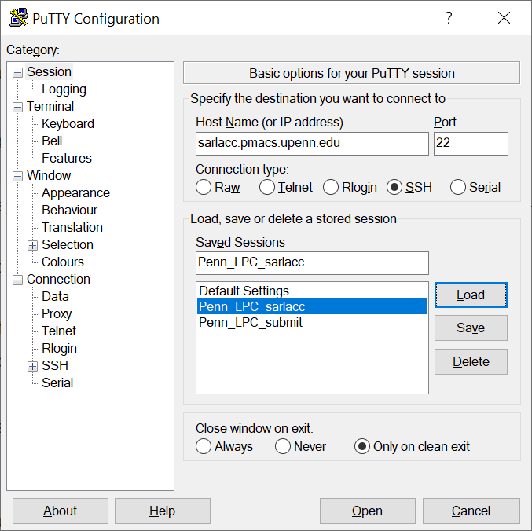
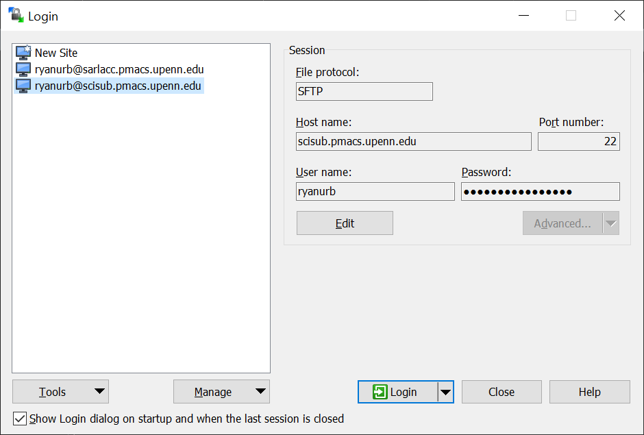
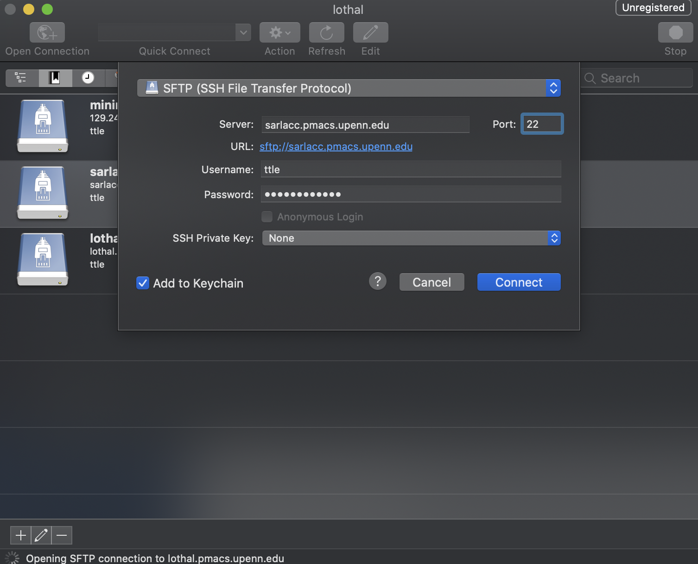

# I2C2 Documentation

*Written by Ryan Urbanowicz in collaboration with members of the Moore Lab (https://github.com/EpistasisLab)

## Contents
- [Introduction](#introduction)
  - [LPC](#lpc)
  - [I2C2](#i2c2)
    - [I2C2 Mailing List](#i2c2-mailing-list)
    - [Contacts](#contacts)
- [Getting Started (all new users)](#getting-started)
- [Logging Into The LPC](#logging-into-the-lpc)
  - [Logging in from Linux:](#logging-in-from-linux)
  - [Logging in from Windows](#logging-in-from-windows)
  - [Logging in from MacOS](#logging-in-from-macos)
    - [Using Cyberduck](#using-cyberduck)
- [Navigating the LPC from a Command Line](#navigating-the-lpc-from-a-command-line)
- [Customizing Your Environment](#customizing-your-environment)
- [Using Queues](#using-queues)
- [Submitting Jobs](#submitting-jobs)
- [Links and Other Resources](#links-and-other-resources)
- [Best Practices](#best-practices)
- [Miscellaneous Tips](#miscellaneous-tips)
- [Troubleshooting](#troubleshooting)
- [LPC Commands Cheat Sheet](#lpc-commands-cheat-sheet)
  - [LSF (job scheduling system) commands](#lsf-job-scheduling-system-commands)
  - [PMACS software module commands](#pmacs-software-module-commands)
  - [Miscellaneous commands](#miscellaneous-commands)
  - [Sample job script](#sample-job-script)
- [I2C2 Example Grant Text](#i2c2-example-grant-text)

## Introduction
### LPC
The LPC (Limited Performance Computing) is a shared computing resource with a large number of processing cores upon which different computational tasks can be run.
The LPC can be used to run computing processes that require a larger amount of memory that most PCs or laptops have available, as well as to run many processes simultaneously (on separate computing cores) and thus parallelize a large number of computational tasks.
Each computing process (e.g., running a machine learning algorithm on a dataset), can be submitted (as a ‘job’) to an appropriate LPC queue (i.e. a program that manages the running of jobs from different users on cores of the LPC.
Each user of the LPC is set up with a home directory within which they can put the code or data they wish to run, and within which job outputs can be saved.
In order to use the LPC you will need to learn how to access it, how to navigate to your home directory, basic unix/linux commands, how to set up your ‘environment’ (so that the software, coding languages, and packages you will need are available to run your job, how to submit a job to a queue, how to manage and monitor your jobs, and best practices for LPC use.
### I2C2
The Informatics Investigator Computing Cluster (I2C2) is a subset of computing resources located within the LPC collaboratively purchased and utilized by a group of informatics faculty stakeholders (at UPenn) with access granted by these stakeholders to students, staff, and occasional collaborators associated with their respective labs. While the purchase and maintenence of this resouce is funded by the stakeholders, there is no additional cost to running individual computing jobs or for data storage space (up to the aloted storage space each faculty member has requested). As of 11/6/2020, this resource does not meet the strict requirements for HIPPA security to protect sensitive patient data, however this is expected to change in the future. This makes it an excellent place to test out code before running it on other secure computing resources, or run processes not working with sensitive patient data. Both CPU and GPU processors are available in I2C2. Once you set up an I2C2 account you will have access to it's resources once you log onto an appropriate LPC server.
#### I2C2 Mailing List
In order to facilitate communication between stakeholders and users of I2C2, a UPenn mailing list has been set up to set up meetings, make announcements, ask questions and inform each other about planned computationally intensive cluster use. Please seek to use this mailing list somewhat sparingly.
You must request access to this mailing list if you are not already on it. This mailing list is managed by Kenneth Hassinger (khas@pennmedicine.upenn.edu). 

This mailing list email is: [TBD as of 11/6/20] 

#### Contacts
A list of PMACS contacts for I2C2 management and troubleshooting.
- Nathanael DiGiorgio: nathansd@upenn.edu
- Curt Calafut: calafutc@upenn.edu
- Christopher Dymek: dymekc@upenn.edu

## Getting Started (all new users)
This section covers the initial steps you will need to take if you are new to the LPC which is managed by PMACS at UPenn. In summary, you will need (1) a PennKey, (2) request an LPC account
- **Step 1: Get your PennKey and request LPC account access.** First, make sure that you have permission from an I2C2 faculty stakeholder to create an account. If you don’t yet have a PennKey, please email (medhelp@pennmedicine.upenn.edu) to request one. Assuming you have one, next email Curt Calafut (calafutc@upenn.edu) with your PennKey, CCing a respective informatics faculty stakeholder (i.e. your lab's PI) to request an I2C2\LPC account within that individuals lab group. You will be assigned an account username which will serve as the name of your home directory as well as be used to log onto the LPC. Your home directory and any hard drive space used will be linked to the faculty stakeholders account (and associated lab hard drive space limits). 
- **Step 2: Set up VPN for off campus LPC access.**
All LPC servers can be accessed (i.e. logged on to) directly while online on campus. However, in order to log on while off campus to certain servers (such as sarlacc) you will first need to connect to campus with a virtual private network (VPN).
  - First, make sure you enroll in [DUO Two-factor authentication](https://wiki.pmacs.upenn.edu/pub/HSRDC_Getting_Started#Duo_Two-Factor_Authentication). This is needed to access most online UPenn resources from off campus.
  - Next install the [Pulse Secure Software](https://www.med.upenn.edu/pmacs/assets/user-content/PMACS%20VPN%20%E2%80%93%20Mac%20OS%20Automated%20Install%20and%20Configuration%20(Preferred).pdf). Detailed instructions can be found [here](https://www.med.upenn.edu/dart/vpn-instructions.html).
- **Step 2 Alternative: You can access the LPC from off campus without VPN**.
You can access either sciget.pmacs.upenn.edu or scisub.pmacs.upenn.edu without VPN and then from any of these you can ssh to sarlacc. You can also directly submit jobs to the LPC from scisub.pmacs.upenn.edu without VPN. Note however that there is talk about sciget and scisub only being available from the VPN in the future (noted on 11/6/20).
- **Step 3: Log onto VPN from off campus**. ([Instructions here](https://www.med.upenn.edu/pmacs/pulseduo.html)).

When each of these are complete, you should be able to log into the LPC using the instructions that follow. 

## Logging into the LPC

To login to the LPC (and reach your home directory) you will need either a terminal program (i.e. command line) or (if preferred) a graphical user interface (GUI) program. These programs differ if you have Windows, Mac or Linux operating systems (OS). Please see the following link for your appropriate operating system and style of login: 
https://wiki.pmacs.upenn.edu/pub/LPC  (Under ‘Login Software Installation’). OS specific examples are provided later in the subsections below. 

Once you have an appropriate program (if needed), you will use it to log on to a server (in this case, one that is used by I2C2). This file server/host is a head node, from which you can navigate to any LPC directories (including your home) and submit jobs.  There are currently a few servers that may be relevant to this group for LPC job submissions, they are called 'I2c2sub', 'scisub', 'sciget', and 'transfer'. Additionally, the 'sarlacc' server is available to those working with the Moore lab. Using I2c2wsub is recommended. 

- I2c2sub (`I2c2sub.pmacs.upenn.edu`) is the virtual submit host created specifically for I2c2 users.  It is only accessible on campus or thorugh VPN. This server is very similar to scisub (below), i.e. it is a virtual host with limited computing power, so scripts generally should not be run locally when logged on, however it is uniquely configured to allow manual installation of environment packages. This virtual machine is comprised of 4 cores with 8 gigs of ram accessible.  Any local tasks collectively run by users that exceeds these limits may end up crashing the host, so be extremely cautious when you run any local commands or scripts. 

- scisub (`scisub.pmacs.upenn.edu`) is the submit host used by most general LPC users.  It is open to the world (SSH only – i.e. a secure remote login protocol). As previously mentioned, from scisub you can also ssh to sarlacc.  Note that unlike sarlacc, scisub is a virtual host with limited computing power.  It cannot be used to run local processes or manually install environment packages. 

- sarlacc (`sarlacc.pmacs.upenn.edu`) is only accessible on campus or through VPN.  This server is ‘beefier’ than others and has its own dedicated cores and storage space. This allows users to run ‘smaller’ computing processes directly on this head node (but this should be avoided).  It also allows users to install and manage their own ‘environment’.  For example if you wish to install the ‘anaconda’ package for running jobs you will need to log onto sarlacc. This server is owned by the Moore lab, and permission from Jason Moore is required for access. 

- In addition, there are 2 other servers relevant to this group for the below tasks, but you cannot submit jobs to the LPC from these servers:
sciget (`sciget.pmacs.upenn.edu`): you can ssh to it and it has outbound network access. Primarily useful for wget, git, svn, etc.
transfer (`transfer.pmacs.upenn.edu`) is used for transferring files from LPC to a local machine (sftp, scp and rsync). You cannot ssh to it.

For the loggin examples below we use `sarlacc` but this can be replaced with `I2c2sub` or the other host names. 

### Logging in from Linux:
Type the following into your terminal command line:
`ssh username@sarlacc.pmacs.upenn.edu`

### Logging in from Windows
Various software is available to log in from Windows. We provide two examples below, and find it useful to install and use both the terminal and GUI software.
The terminal is best for submitting jobs and the GUI is best for navigating and managing the file hierarchy and copying files to and from the LPC.

- **Windows (Terminal): [Putty](https://www.chiark.greenend.org.uk/~sgtatham/putty/)**
- **Windows (GUI): [WinSCP](https://winscp.net/eng/download.php)**

**Logging in with Putty:**
- Ensure you are connected to VPN via PulseSecure.
- Open the putty .exe file
- In the ‘Session’ window, enter `sarlacc.pmacs.upenn.edu` under ‘Host Name’
- Confirm `‘Port’ = 22` and `‘Connection type’ = SSH`
- [For convenience] In the ‘Connection/Data’ window put the LPC username you were assigned into ‘auto-login username’
- [For convenience] Go back to the ‘Session’ window and type in any session ‘name’ into ‘Saved Sessions’. E.g. ‘LPC_sarlacc’
- [For convenience] Click save, and this information will be available to be loaded your next time opening Putty
- Make sure you session is loaded and click ‘Open’ at bottom of the window
- A terminal will open up requesting your username (if you didn’t save it in step 5).
- Lastly you will be prompted for your password.



**Logging in with WinSCP:**
- Ensure you are connected to VPN via PulseSecure.
- Open WinSCP software
- In the ‘Session’ window, enter `sarlacc.pmacs.upenn.edu` under ‘Host Name’
- Confirm `‘Port’ = 22`, `‘Connection type’ = SSH`, and `‘File protocol’ = SFTP`
- Enter your username and password where indicated 
- [For convenience] Click Save and give your session any name for future use.
- Click ‘Login’ to connect, and a GUI will open up allowing you to view both your local PC’s directory as well as the directory on the LPC (it should open you up to your home directory the first time logging on).

Note that it is also possible to configure WinSCP to automatically open a putty terminal upon connection.



### Logging in from MacOS
As mentioned in the above section, while MacOS built-in terminal is sufficient for submitting jobs, the Cyberduck GUI can be helpful for navigating the file structure.

#### Using Cyberduck
- [Download](https://cyberduck.io/download/) Cyberduck
- Ensure you are connected to VPN via PulseSecure
- Open Cyberduck
- Select `Open Connection` on the top left
- In this window, select `SFTP (SSH File Transfer Protocol)`
- Enter `sarlacc.pmacs.upenn.edu` under `'Server'`
- Confirm `'Port' = 22`
- Enter your PMACS username and password
- Click `Connect`, and a GUI will open up allowing you to view the directory on the LPC (it should open you up to your home directory the first time logging on).



## Navigating the LPC from a command line
Linux commands are needed to navigate the LPC from a terminal (e.g. PuTTY).
See the following link for an overview of basic Linux commands: 

https://wiki.pmacs.upenn.edu/pub/Linux_Basics

Some of the most commonly used basic commands include:

- `ls` (lists contents of current directory)
- `ls -a` (lists contents of current directory including hidden files)
- `cd somedirectory` (move from current directory to ‘somedirectory’)
- `cd ..` (move back one level in the folder hierarchy towards the root folder)
- `mkdir somedirectory` (make a new directory called `somedirectory`)
- `head myfile.txt` (show the beginning of a file)

A great tutorial on how to effectively use a Unix command line is available at https://missing.csail.mit.edu/. 

## Customizing your environment

Depending on what you want to run on the LPC, you may need to install various applications, packages, programming language versions, etc.
To avoid confusion and keep things centralized, PMACS installs and manages common applications in a shared central directory that are available to all the hosts in our cluster.
The LPC terms these environmental elements as ‘modules’.
Modules can be loaded or unloaded to be made available in your run environment.
This means that these modules will be available if you were to run a program locally on 'sarlacc', or when you submit a job from a given host (i.e., 'sarlacc' or 'scisub').
Terminal commands for working with modules are available at this link:

https://wiki.pmacs.upenn.edu/pub/LPC#Modules

Alternatively if some application or package is not available or (for some reason) can’t be installed by PMACS under modules, you can install such packages or applications in your home directory (assuming you are logged onto 'sarlacc'! and not 'scisub').
Be advised that PMACS provides very limited (if any) support when loading or using such installations on your own, so some troubleshooting may be required on your part.

## Using queues
The first thing to understand before trying to schedule jobs are ‘queues’.
At face value, a queue represents a set of pending jobs (i.e. a ‘container’ for jobs).
On the LPC different queues are available to different user groups allowing them to run their jobs.
You must be associated with, and have permission from, a specific user group (e.g. I2C2) in order to submit jobs to their associated queue.
Each queue is set up by PMACS with their own set of rules, defaults, and access to specific execute hosts (i.e. the servers comprised of computing cores where individual jobs are run). I2C2 queues are specified at the end of this section.

There are a few general queue types offered by the LPC:

- `normal`: For most jobs.
- `long`: For long running jobs (more than 24 hr).
- `interactive`: For jobs that are run interactively.

More information on queues in general is available here: https://wiki.pmacs.upenn.edu/pub/LSF_Basics

I2C2 has it's own queues to which users can submit jobs. Currently there are very few rules/restrictions (e.g. maximum job runtime) for using each queue, however this may be updated in the future as needed by I2C2 faculty stakeholders. The I2C2 queues are as follows:

- `i2c2_normal` This queue is the typical one used for most jobs which can be run on a single or multiple CPU cores. 1 THREAD per job slot. Use -n option to request more.

- `i2c2_interactive` This queue is set up to specifically run interactive processes. 1 THREAD per job slot. Use -n option to request more.

- `i2c2_gpu` This queue is set up to run jobs on GPU cores. 1 THREAD per job slot. Use -n option to request more.

## Submitting Jobs
High performance parallel computing codes generally run in "batch" mode.
Batch jobs are controlled by scripts written by the user and submitted to a batch system that manages the compute resource and schedules the job to run based on a set of policies. We use the term "job" to refer to a "batch job".

Computing ‘jobs’ can be submitted individually from the command line, or you can write and run an executable script to submit multiple jobs to a queue simultaneously. 

An example of a python script designed to run an exploratory data analysis either on a local machine or on the LPC is included in this repository:
- `ExploratoryAnalysisMain.py`
- `ExploratoryAnalysisJob.py`

**IBM's LSF documentation is available here:**
https://www.ibm.com/support/knowledgecenter/en/SSWRJV_10.1.0/lsf_welcome/lsf_welcome.html

## Links and other resources
### PMACS Links
- [PMACS Wiki - LPC](https://wiki.pmacs.upenn.edu/pub/LPC)
- [PMACS Wiki - LSF Basics](https://wiki.pmacs.upenn.edu/pub/LSF_Basics)
- [PMACS Wiki - Batch Computing](https://wiki.pmacs.upenn.edu/pub/Batch_Computing)

## Best Practices
Here we offer some suggestions for using the cluster so that the I2C2 community of researchers can maximize productivity and fairly share this resource.
- Check that your jobs have completed within a reasonable amount of time. If they are running much longer than expected, make sure to 'kill' these jobs so that they do not run indefinitely on the cluster, hogging resources. 
- Specify 'reserved' and 'maximum' memory limitations for your jobs. This will help you to avoid failed jobs due to hitting memory limits, and for us all to make the most efficient use of the LPC.
- Avoid specifying unnecessarily large 'reserved' or 'maximum' memory limitations for jobs.  This is most important for 'reserved' memory limitations, as your job will take up more cores than may be necessary for it to run. This will reduce the total number of jobs that can be run on I2C2 by all users. 
- Periodidally delete job submission files, files in your scratch folder, or files/data that are no longer needed.  This is mainly good practice for within your lab-group, as it impacts your lab-groups storage limitations, but should not impact other lab groups.
- If you plan to run a particularly computationally expensive and or time/consuming set of jobs, it would be helpful to send out an email to the I2C2 mailing list so that others can plan accordingly, as they may also have time sensitive jobs to run. 

## Miscellaneous Tips
To avoid accidental deletion or overwriting of files it is recommended that you put these aliases in your .bashrc:

- alias rm='rm -i'
- alias mv='mv -i'
- alias cp='cp -i'

Each of these will prompt linux to ask you confirmation for the corresponding action.

## Troubleshooting

If you have any question, you could email Curt. Curt's email address: calafutc@upenn.edu.
It’s also a good idea to provide your ip address when asking a question regarding connection: http://www.med.upenn.edu/myip.
If there is still issue connecting to sarlacc, try emptying the contents of the `~/.ssh/known_hosts` file.

## LPC Commands Cheat Sheet

### LSF (job scheduling system) commands

| Command | Description |
|---------|-------------|
| `bjobs` | Show unfinished jobs |
| `bjobs -sum` | Summarize active jobs |
| `bjobs -u ryanurb` | Show jobs for user `ryanurb` | 
| `bkill 12345` | Kill job with ID `12345` |
| `bkill 0` | Kill all jobs that belong to you |
| `bhosts doi_exe` | Show server hosts |
| `bhosts` | Show all hosts |
| `bswitch` | Switch a job to a different queue |

Some other LSF commands can be found [here](https://www.med.upenn.edu/hpc/assets/user-content/documents/lsf-quick-reference_user_commands.pdf).

### PMACS software module commands

| Command | Description |
|---------|-------------|
| `module list` | List loaded modules |
| `module avail` | List all available modules |
| `module avail python` | List available python modules |
| `module load python/3.7` | Loads the module named `python/3.7` |
| `module unload python/2.7.10` | Unloads the module named `python/2.7.10` |
| `module switch gcc/4.9.4 gcc/6.2.0` | Swap out module `gcc/4.9.4` for `gcc/6.2.0` (useful for changing software versions) |

### Miscellaneous commands

| Command | Description |
|---------|-------------|
| `df -h` | Get current disk usage and total disk capacity |
| `du -hs` | Get size of current directory |

### Sample job script

```bash
#!/bin/bash
#BSUB -J myjobname
#BSUB -o outputfile.%J.out
#BSUB -e errorfile.%J.err
#BSUB -q epistasis_normal 
#BSUB -M 10000
module add python/3.7
cd /project/moore/users/myhomedirectory
python3.7 script.py -parA 0 -parB value
```

Assuming this is saved to a file named `script.sh`, you can submit the job by running:

```bash
$ bsub < script.sh
```
## I2C2 Example Grant Text
Newly available as of July 2020, is the Informatics Investigator Computing Cluster (I2C2), a dedicated resource for faculty stakeholders within the Department of Informatics, similarly managed by PMACS, with 384 virtual cores each with 6 Gb of RAM.

*I2C2 Parallel Computing Resource*
The I2C2 is a dedicated resource shared by faculty stakeholders in the Division of Informatics. It consists of four dedicated physical compute servers: 3 Dell PowerEdge R6525 hosts (each with 2 AMD DPYC 7742 64-Core Processors and 768GB DDR4 RAM), and 1 Supermicro SYS-4029GP-TRT2 GPU core including 2 Intel Xeon Gold 6226 Processors, 128 GB DDR4 RAM, and 10 NVIDIA GeFORCE RTX 2080Ti graphics cards. In total the dedicated compute components of the enviornment include include 408 processing cores (816 threads), 43,520 CUDA cores, and nearly 2.5 TB (2,432 GB) of RAM. The cluster employs IBM Spectrum LSF for job scheduling, and each host in the environment runs CentOS 7.  File storage is provided by dedicated NFS v4 servers on VMware Virtual Machines.  The environment is hosted in the Brownstown Data Center and is managed by a team of full-time systems administrators. The Brownstown Data Center is Lancaster General Health’s (a division of Penn Medicine) 24 x 7 primary data center supporting Tier 1 mission critical and patient safety production systems.  It has Tier 3 data center capability, which includes N+1 redundant and maintainable capability for all components including fire suppression, dual generators with fuel capacity for three days,  redundant UPS’, and five separate CRAC units with separate chillers, maximizing environmental and system uptime.  It has access controls for entry including security cameras covering door entry, interior data center views as well as cameras around the facility.

